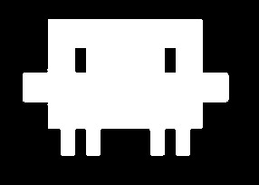
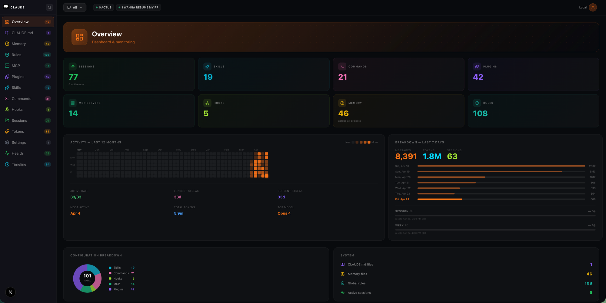

<p align="center">
  
</p>

<h1 align="center">Claude Dashboard</h1>

<p align="center">
  <strong>The missing GUI for Claude Code.</strong>
</p>

<p align="center">
  Browse sessions, memory, skills, hooks, MCP servers, commands, and settings<br/>
  - all from one beautiful, local-first dashboard.
</p>

<p align="center">
  
  
  
  
</p>

<br/>


<p align="center">
  
</p>

<br/>

## Get Started

```bash
curl -fsSL https://raw.githubusercontent.com/bunlongheng/claude-dashboard/main/install.sh | bash
cd claude-dashboard && npm run dev
```

Open **http://localhost:3000** - done. No config, no database, no account.

> **Requires:** [Node.js 18+](https://nodejs.org/) and [Claude Code](https://docs.anthropic.com/en/docs/claude-code)

<br/>

## What You Get

<table>
<tr>
<td width="50%">

### Overview
See all your projects, session counts, memory stats, and system health at a glance.

### Memory
Browse every memory file across all projects - user preferences, feedback, project decisions.

### Sessions
Full session history. See what Claude worked on, when, and in which project.

</td>
<td width="50%">

### Skills & Commands
View all custom skills and slash commands Claude has access to.

### MCP Servers
Every configured MCP server, its tools, and connection status.

### Hooks
Event hooks running on tool calls, file edits, and notifications.

</td>
</tr>
</table>

<br/>

## All Pages

| | Page | Description |
|:---:|------|-------------|
| :bar_chart: | **Overview** | Project count, session stats, memory health |
| :book: | **CLAUDE.md** | Global instructions Claude reads on every startup |
| :brain: | **Memory** | What Claude remembers about you and your projects |
| :shield: | **Rules** | Per-project rules and instruction files |
| :electric_plug: | **MCP** | Model Context Protocol server configs |
| :package: | **Plugins** | Installed plugin directories |
| :sparkles: | **Skills** | Reusable prompts and workflows |
| :keyboard: | **Commands** | Slash commands across all projects |
| :hook: | **Hooks** | Event-driven automation hooks |
| :file_folder: | **Sessions** | Complete session history and transcripts |
| :gear: | **Settings** | Global and local Claude Code settings |

<br/>

## How It Works

```
~/.claude/                        Your Claude Code data (already exists)
  CLAUDE.md                       Global instructions
  settings.json                   Your preferences
  projects/
    your-project/
      memory/                     What Claude remembers
      *.jsonl                     Session transcripts
```

The dashboard reads these files directly. **Nothing is uploaded. Nothing leaves your machine.**

<br/>

## Optional: Connect a Database

The dashboard works fully without a database. But if you connect one, you unlock:

| Feature | What you gain |
|---------|--------------|
| **Token tracking** | See API usage (input/output tokens, cost) across all sessions |
| **Remote access** | Access your dashboard from your phone with login protection |
| **Global rules** | Create and manage custom instruction rules |
| **Real-time sync** | Live updates when new sessions or token data arrives |

**SQLite** is included by default - auto-created at `~/.claude/dashboard.db`. No setup needed. All features work with any supported database.

| Backend | Setup | Status |
|---------|-------|--------|
| **SQLite** (default) | Automatic - zero config | Built-in |
| **PostgreSQL** | Planned | Coming soon |
| **Custom** | Implement `DbAdapter` in `lib/db/` | DIY |

<br/>

## Built With

[Next.js 16](https://nextjs.org/) | [Tailwind CSS](https://tailwindcss.com/) | [Lucide Icons](https://lucide.dev/) | [Framer Motion](https://www.framer.com/motion/)

<br/>

## Contributing

We welcome contributions! Here's how:

```bash
git clone https://github.com/bunlongheng/claude-dashboard.git
cd claude-dashboard
npm install
npm run dev
```

1. Fork the repo
2. Create your branch (`git checkout -b feature/awesome`)
3. Make your changes
4. Push and open a PR

<br/>

## License

[MIT](LICENSE) - use it however you want.

---

<p align="center">
  <sub>Built by <a href="https://www.bunlongheng.com">Bunlong Heng</a> for the Claude Code community</sub>
</p>
