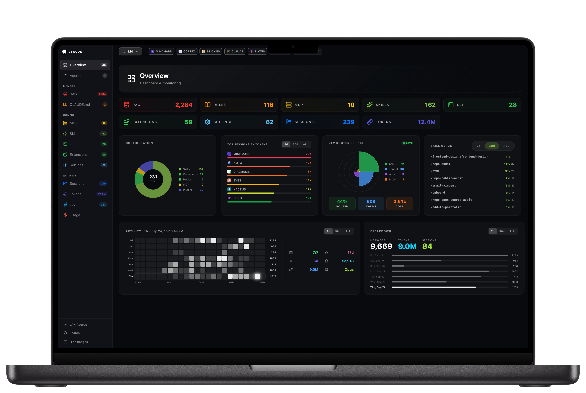
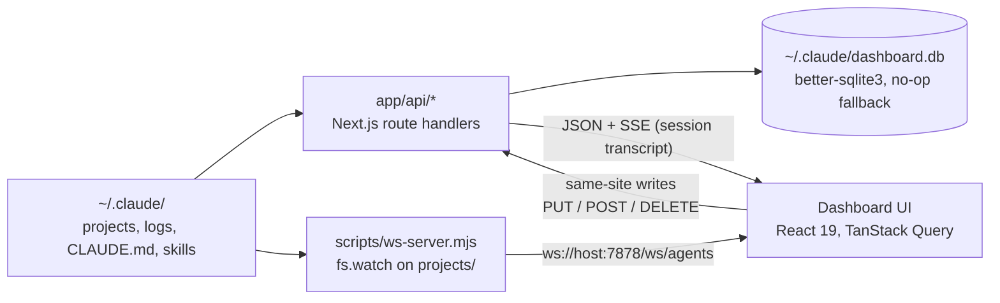

#  Claude Dashboard

**The missing GUI for Claude Code.**

A local-first dashboard that reads your `~/.claude/` folder directly and shows sessions, tokens, context, memory, model routing, skills, hooks and MCP servers in 1 place. Zero config, no account, nothing leaves your machine.




[](LICENSE)

## Contents

- [Features](#features)
- [Read this before you clone](#read-this-before-you-clone)
- [Quick start](#quick-start)
- [How it works](#how-it-works)
- [Configuration](#configuration)
- [Jev router](#jev-router-optional)
- [API](#api)
- [MCP server](#mcp-server)
- [Tech stack](#tech-stack)

## Features

- **Dashboard** - stat cards, config donut, top sessions, Jev card, activity heatmap.
- **Sessions** - live thinking state, tool calls, streaming output, Markdown export.
- **Tokens and usage** - daily charts, cost by model and project, plan pricing, punchcard.
- **Agents** - 12 color-coded specialists plus subagent run history.
- **Jev router** (opt-in) - tier and agent per prompt, confidence, latency, cost, on/off switch.
- **RAG memory** (opt-in) - local FTS5 index over transcripts and CLAUDE.md, with a benchmark tab.
- **Config editors** - edit CLAUDE.md, command files and hooks.json in place; settings.json is view-only.
- **Skills, hooks, commands, MCP, plugins** - every extension with its source file.
- **Multi-machine** - 1 dashboard, read-only proxy to peers on your LAN.
- **Cmd+K search, QR code for LAN access, active-session pills.** Mobile works.

## Read this before you clone

| You provide | Why | Free option |
|-------------|-----|-------------|
| Node.js 20.9+ | Next.js 16 runtime | [nodejs.org](https://nodejs.org/) |
| A `~/.claude/` folder | The dashboard reads it directly | Comes with [Claude Code](https://docs.anthropic.com/en/docs/claude-code) |
| `AI_GATEWAY_API_KEY` (optional) | Your own Jev router hook, about $0.00002 per prompt (shell env, not `.env.local`) | [Vercel AI Gateway](https://vercel.com/ai-gateway) |
| `ANTHROPIC_API_KEY` (optional) | RAG benchmark tab only | Not needed for the rest |

## Quick start

```bash
git clone https://github.com/bunlongheng/claude-dashboard.git
cd claude-dashboard
npm install
npm run dev        # UI only, http://localhost:3003
npm run dev:full   # UI + the WebSocket watcher on :7878 (live agents feed)
```

Or 1 line: `curl -fsSL https://raw.githubusercontent.com/bunlongheng/claude-dashboard/main/install.sh | bash` (runs `npm run dev`).

The port is fixed at 3003 by the npm scripts. `npm run dev:lan` binds both servers to `0.0.0.0` for iPad or LAN use.

Verify: `npm run lint`, `npx tsc --noEmit`, `npm test` (unit), `npm run test:e2e` (Playwright, needs a running dev server). `npm run build` is a plain `next build`; `npm run sync-icons` refreshes app icons separately.

## How it works


```mermaid
flowchart LR
    C["~/.claude/\nprojects, logs, CLAUDE.md, skills"] --> API["app/api/*\nNext.js route handlers"]
    C --> WS["scripts/ws-server.mjs\nfs.watch on projects/"]
    API --> DB[("~/.claude/dashboard.db\nbetter-sqlite3, no-op fallback")]
    API -- "JSON + SSE (session transcript)" --> UI["Dashboard UI\nReact 19, TanStack Query"]
    WS -- "ws://host:7878/ws/agents" --> UI
    UI -- "same-site writes\nPUT / POST / DELETE" --> API
```

Route handlers tail-read your `~/.claude` files on demand and cache CLAUDE.md history in a local SQLite file. A session's live transcript streams over SSE from `/api/claude/claude-sessions/[id]/stream`. Only the agents feed uses the WebSocket on port 7878, which `npm run dev:full`, `dev:lan` and `prod` start for you; plain `npm run dev` falls back to polling. No upload, no database server.

## Configuration

Everything works with 0 config. Only set what you need in `.env.local`. Every var below is read by the code; see `.env.example` for the RAG paths, eval models and local-apps extras.

| Env var | Purpose |
|---------|---------|
| `DASHBOARD_HOST` | Bind address for Next, default `127.0.0.1` (`0.0.0.0` for LAN) |
| `WS_LAN` | `1` binds the WebSocket watcher to `0.0.0.0`; default `127.0.0.1` only |
| `PORT` | Port the LAN/QR and machines routes advertise; the scripts always start Next on 3003, so leave it unset or set `3003` |
| `MACHINES` | Peer dashboards, e.g. `mini.local:3003,pi.local:3003` |
| `LOCAL_MACHINE_ID` | This machine's id in the peer list, default hostname |
| `NEXT_PUBLIC_RAG_ENABLED` | `1` enables the RAG page |
| `ANTHROPIC_API_KEY` | RAG preference extraction, insights and the benchmark tab |
| `SQLITE_PATH` | Session index file, default `~/.claude/dashboard.db` |
| `FRAME_ANCESTORS` | Origins allowed to iframe the dashboard, default none |
| `CLAUDE_DASHBOARD_URL` | Base URL the MCP server proxies to, default `http://localhost:3003` |

## Jev router (optional)

[Jev](https://typesafe.ai) is a tiny decision model. A `UserPromptSubmit` hook asks it which tier (haiku, sonnet, opus, fable) and which specialist agent each prompt needs, then injects the answer so the main model delegates cheaply. 1 JSON line per prompt, charted on the **Jev** page.

The hook itself is not part of this repo. The dashboard only reads what a hook writes:

| File | Role |
|------|------|
| `~/.claude/hooks/jev-router.sh` | Your `UserPromptSubmit` hook. Calls Jev with `AI_GATEWAY_API_KEY` or `TYPESAFE_API_KEY` from your shell env (not `.env.local`), then prints the tier and agent |
| `~/.claude/logs/jev.jsonl` | 1 JSON line per prompt appended by the hook; `GET /api/claude/jev?days=7` charts it |
| `~/.claude/jev-router.json` | The on/off switch. **on** lets Jev pick, **off** pins every open session to 1 tier via `PUT /api/claude/jev/router` |

Below 0.5 confidence the main model decides. Without the hook the Jev page simply shows 0 prompts.

| | Agent | Role | Model | Owns |
|---|-------|------|-------|------|
|  | **Snow** | Research | haiku | explore, find, study how something works; the catch-all |
|  | **Rock** | Investigate | haiku | status checks, counts, batch comparisons |
|  | **Blitz** | Fix / Code | sonnet | surgical patches, lint and type errors, updates |
|  | **Venus** | UI / Frontend | sonnet | styling, layout, dark mode, icons, images |
|  | **Pulse** | Create / Build | sonnet | new features, pages, scaffolding, seeding |
|  | **Earth** | Cleanup | sonnet | dead code, duplicates, import cleanup |
|  | **Sand** | Storage | sonnet | SQLite, Postgres, migrations, indexes |
|  | **Frost** | Analytics | sonnet | charts, stat cards, aggregation |
|  | **Zap** | Performance | sonnet | bundle, render, caching, Lighthouse |
|  | **Arrow** | QA / Audit | sonnet | test runs, E2E, visual diff, verification |
|  | **Blaze** | Architecture | opus | plans, schemas, boundaries, tradeoffs |
|  | **Shadow** | Security | fable | CSP, auth, secrets, exposure, ranking findings |

## API

All routes are local and unauthenticated. `GET` routes are open to anything that can reach the port, so keep the default `127.0.0.1` bind unless you trust the network. Every non-`GET` route, plus the `search`, `brain`, `settings` and `proxy` reads, requires a same-site browser call (`Sec-Fetch-Site` plus a trusted `Host`, see `lib/route-guard.ts`); `curl` and pages on another origin get `403`. The service worker never caches `/api/*`.

| Route | Methods | Returns or does |
|-------|---------|-----------------|
| `/api/claude/sessions` | GET, DELETE | `{projects:[{project,path,machine,sessions:[{id,title,createdAt,updatedAt,sizeBytes,live}]}]}`; DELETE removes 1 `.jsonl` under `~/.claude/projects` |
| `/api/claude/token-stats` | GET | Daily tokens and cost by model and project |
| `/api/claude/agents` | GET | Agent roster and subagent run history |
| `/api/claude/jev?days=7` | GET | Jev router totals, tiers, per-prompt log |
| `/api/claude/jev/router` | GET, PUT | Read or flip the router switch (`force`: `null` or 1 of haiku, sonnet, opus, fable) |
| `/api/claude/search?q=` | GET (same-site) | Cmd+K search across sessions, skills and config |
| `/api/claude/skills` | GET, PUT | Extensions list; PUT writes CLAUDE.md, a command `.md` or `hooks.json` under `~/.claude` |
| `/api/claude/machines` | GET | Peers from `MACHINES` and their health |

The full list with every method is in [docs/api.md](docs/api.md).

## MCP server

`mcp-server.ts` exposes the RAG index to Claude Code as 4 tools (`rag_search`, `rag_context`, `rag_preferences`, `rag_health`). Register it with `claude mcp add rag-memory -- npx -y tsx /absolute/path/claude-dashboard/mcp-server.ts` while the dashboard is running. Details in [docs/mcp.md](docs/mcp.md).

## Tech stack

- Next.js 16 App Router, React 19, TypeScript, Tailwind
- better-sqlite3 for the local session index, with a no-op fallback when the native module is missing
- TanStack Query for client data, Recharts for charts, ws for the file watcher
- Vitest, Testing Library and MSW for unit tests, Playwright for E2E
- Runs on your machine only. No hosting, no account, no telemetry

## Inspired by

Token analytics from [phuryn/claude-usage](https://github.com/phuryn/claude-usage) and [nateherkai/token-dashboard](https://github.com/nateherkai/token-dashboard). Memory ideas from [affaan-m/everything-claude-code](https://github.com/affaan-m/everything-claude-code), [MemPalace/mempalace](https://github.com/MemPalace/mempalace), [thedotmack/claude-mem](https://github.com/thedotmack/claude-mem), [coleam00/claude-memory-compiler](https://github.com/coleam00/claude-memory-compiler), [lyonzin/knowledge-rag](https://github.com/lyonzin/knowledge-rag), [HKUDS/LightRAG](https://github.com/HKUDS/LightRAG), [Ricardo-Kaminski/local-rag](https://github.com/Ricardo-Kaminski/local-rag), [doobidoo/mcp-memory-service](https://github.com/doobidoo/mcp-memory-service) and [mem0ai/mem0](https://github.com/mem0ai/mem0).

## Contributing

See [CONTRIBUTING.md](CONTRIBUTING.md) for the branch, verify and pre-push hook steps.

---

<div align="center">

<a href="https://bunlongheng.com"></a>
<a href="https://www.linkedin.com/in/bunlongheng/"></a>
<a href="https://www.instagram.com/ibunlong/"></a>
<a href="mailto:bheng.code@gmail.com"></a>

<br>

Built by **[Bunlong](https://bunlongheng.com)** &nbsp;&middot;&nbsp; [more apps](https://bunlongheng.com/projects)

</div>
