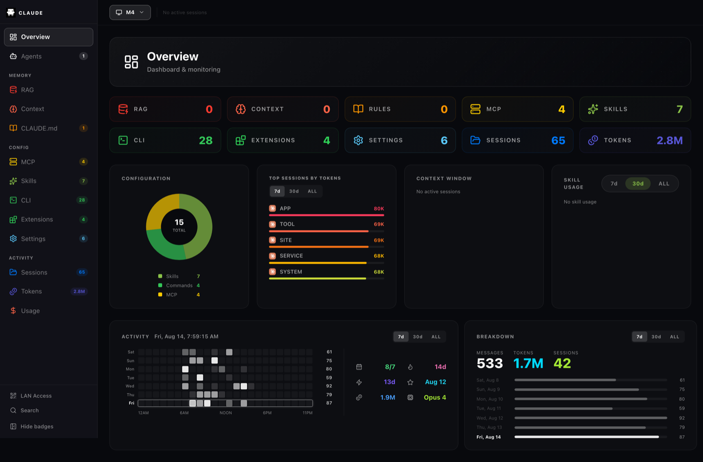
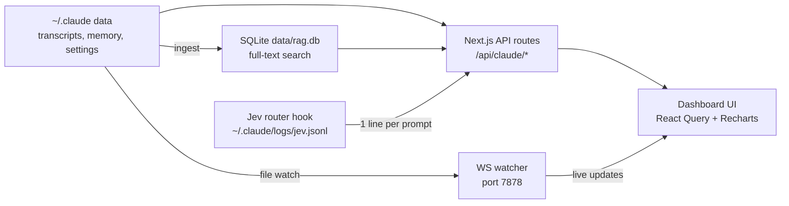

<p align="center">
  
</p>

<h1 align="center">Claude Dashboard</h1>

<p align="center">
  <strong>The missing GUI for Claude Code.</strong><br/>
  Sessions, tokens, context, memory, model routing, skills, hooks and MCP servers in one local-first dashboard.<br/>
  Zero config - it reads <code>~/.claude/</code> directly and nothing leaves your machine.
</p>

<p align="center">
  
  
  
  
</p>

<p align="center">
  
</p>

## Get Started

```bash
curl -fsSL https://raw.githubusercontent.com/bunlongheng/claude-dashboard/main/install.sh | bash
```

Or `git clone` and `npm run setup`. Open **http://localhost:3003**. Needs [Node.js 20.9+](https://nodejs.org/) and an existing `~/.claude/` from [Claude Code](https://docs.anthropic.com/en/docs/claude-code).

## What You Get

| Page | What it shows |
|------|--------------|
| **Dashboard** | 12 stat cards, config donut, top sessions, live context window bars, activity heatmap, 7-day breakdown |
| **Sessions** | Every session with live thinking state, tool calls, streaming, and Markdown export |
| **Tokens / Usage** | Daily stacked charts, per-model and per-project cost, plan-aware pricing (API / Pro / Max), punchcard |
| **Agents** | 12 color-coded specialist agents and subagent run history: status, duration, success rate |
| **Jev** *(opt-in)* | Model-routing hook: tier and agent per prompt, confidence, latency, cost, and an on/off switch |
| **RAG** *(opt-in)* | Local FTS5 memory over transcripts and CLAUDE.md, preference extraction, benchmark |
| **Global / Settings** | Edit CLAUDE.md, settings.json and settings.local.json in place |
| **Skills / Commands / Hooks / MCP / Plugins / Extensions** | Everything installed, with source locations and MCP connection status |

Plus Cmd+K global search, a QR code for LAN access, a machine switcher, and active-session pills in the top bar. Mobile works.

## How It Works


```mermaid
flowchart LR
    FS["~/.claude data<br>transcripts, memory, settings"]
    API["Next.js API routes<br>/api/claude/*"]
    DB["SQLite data/rag.db<br>full-text search"]
    JEV["Jev router hook<br>~/.claude/logs/jev.jsonl"]
    WS["WS watcher<br>port 7878"]
    UI["Dashboard UI<br>React Query + Recharts"]

    FS --> API --> UI
    FS -->|ingest| DB --> API
    JEV -->|1 line per prompt| API
    FS -->|file watch| WS -->|live updates| UI
```

Tail-reads your `~/.claude` files, indexes them into a local SQLite file, and streams changes to the UI. No upload, no account, no database server.

## Multi-Machine (optional)

Run it on each machine (`PORT=3003 npm run prod`) and list the peers on your main one:

```
# .env.local
MACHINES=mac-mini.local:3003,raspberrypi.local:3003
```

Peer data is fetched read-only through a same-origin proxy. No remote exec, no shared token.

## RAG Memory (optional)

```
# .env.local
NEXT_PUBLIC_RAG_ENABLED=1
```

Open `/rag` and click **Re-ingest**. Transcripts, memory and CLAUDE.md go into a SQLite FTS5 index. 2 hooks close the loop: `SessionStart` asks the dashboard for context, `Stop` ingests the session that just ended. FTS5 is the only mode because it won the benchmark against vectors (4.4 vs 4.1 of 5) with 0 dependencies. The **Benchmark** tab re-runs that on your own questions (needs `ANTHROPIC_API_KEY`).

## Jev Router (optional)

[Jev](https://typesafe.ai) is a tiny decision model. A `UserPromptSubmit` hook asks it, per prompt, which model tier (haiku, sonnet, opus, fable) and which specialist agent the request needs, then injects the answer so the main model delegates cheaply. About $0.00002 a call, 1 JSON line per prompt, and the **Jev** page charts it.

```bash
git clone https://github.com/bunlongheng/claude-code.git ~/.claude
python3 ~/.claude/scripts/install-hooks.py
export AI_GATEWAY_API_KEY=...   # or TYPESAFE_API_KEY
```

The switch on the page writes `~/.claude/jev-router.json`: **on** lets Jev pick, **off** pins every open session to 1 tier.

### Agent squad

12 agents ship as subagent definitions in `~/.claude/agents/`, 1 file per role. Jev answers `agent=venus (0.99), tier=sonnet (0.77)` and the main model delegates to `subagent_type=venus`. Below 0.5 confidence the main model decides; questions, diff reviews and ranking findings never leave the main thread.

| Agent | Role | Model | Owns |
|-------|------|-------|------|
|   **Snow** | Commander / Research | haiku | explore, find, study how something works; the catch-all |
|   **Rock** | Investigate | haiku | status checks, counts, batch comparisons |
|   **Blitz** | Fix / Code | sonnet | surgical patches, lint and type errors, updates |
|   **Venus** | UI / Frontend | sonnet | styling, layout, dark mode, icons, images |
|   **Pulse** | Create / Build | sonnet | new features, pages, scaffolding, seeding |
|   **Earth** | Cleanup | sonnet | dead code, duplicates, import cleanup |
|   **Sand** | Storage | sonnet | SQLite, Postgres, migrations, indexes |
|   **Frost** | Analytics | sonnet | charts, stat cards, aggregation |
|   **Zap** | Performance | sonnet | bundle, render, caching, Lighthouse |
|   **Arrow** | QA / Audit | sonnet | test runs, E2E, visual diff, verification |
|   **Blaze** | Architecture | opus | plans, schemas, boundaries, tradeoffs |
|   **Shadow** | Security | fable | CSP, auth, secrets, exposure, ranking findings |

## Inspired By

Token analytics from [phuryn/claude-usage](https://github.com/phuryn/claude-usage) and [nateherkai/token-dashboard](https://github.com/nateherkai/token-dashboard). Memory ideas from [affaan-m/everything-claude-code](https://github.com/affaan-m/everything-claude-code), [MemPalace/mempalace](https://github.com/MemPalace/mempalace), [thedotmack/claude-mem](https://github.com/thedotmack/claude-mem), [coleam00/claude-memory-compiler](https://github.com/coleam00/claude-memory-compiler), [lyonzin/knowledge-rag](https://github.com/lyonzin/knowledge-rag), [HKUDS/LightRAG](https://github.com/HKUDS/LightRAG), [Ricardo-Kaminski/local-rag](https://github.com/Ricardo-Kaminski/local-rag), [doobidoo/mcp-memory-service](https://github.com/doobidoo/mcp-memory-service) and [mem0ai/mem0](https://github.com/mem0ai/mem0). Thank you.

## Contributing

Fork, branch (`feature/awesome`), `npm run dev`, open a PR.

## License

[PolyForm Noncommercial 1.0.0](LICENSE) - free for any noncommercial use.

<p align="center">
  <sub>Built by <a href="https://bunlongheng.com">Bunlong Heng</a> for the Claude Code community &middot; <a href="https://bunlongheng.com/projects/claude-dashboard">Portfolio &rarr;</a></sub>
</p>
